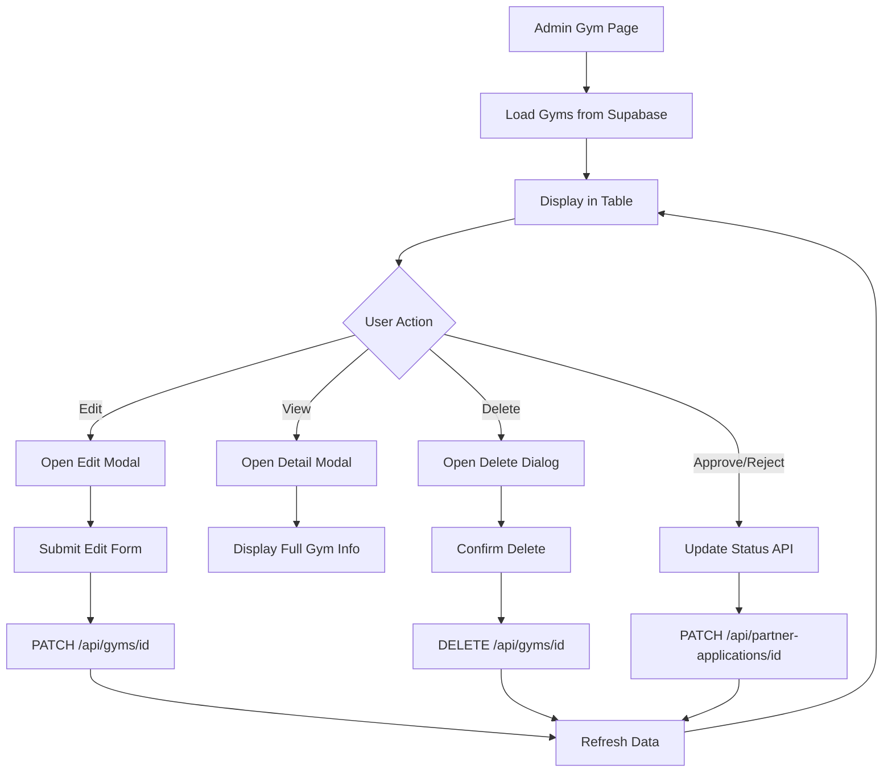

# Design Document: Admin Gym Management System

## Overview

ระบบจัดการยิมสำหรับผู้ดูแลระบบเป็นการปรับปรุงหน้า `/admin/dashboard/gyms` ให้มีความสามารถในการจัดการยิมแบบครบวงจร โดยเพิ่มฟีเจอร์การดูรายละเอียด อนุมัติ/ปฏิเสธ แก้ไข และลบยิมได้จากหน้าเดียว ระบบจะใช้ Supabase เป็น backend และ HeroUI components สำหรับ UI

### Key Features
- ดูรายละเอียดยิมแบบเต็มรูปแบบใน modal พร้อม image gallery
- อนุมัติ/ปฏิเสธยิมพร้อมอัพเดท role ของ user
- แก้ไขข้อมูลยิมทุก field ด้วย form validation
- ลบยิมพร้อม confirmation dialog
- ค้นหาและกรองยิมแบบ real-time
- แสดงสถิติยิมแบบ live update

## Architecture

### Component Structure

```
src/app/admin/dashboard/gyms/
├── page.tsx (Main page - updated)
└── components/
    ├── GymDetailModal.tsx (NEW)
    ├── GymEditModal.tsx (NEW)
    ├── GymDeleteDialog.tsx (NEW)
    └── GymStatsCards.tsx (NEW)

src/app/api/gyms/
├── route.ts (existing - GET all gyms)
└── [id]/
    └── route.ts (NEW - GET, PATCH, DELETE single gym)
```

### Data Flow



## Components and Interfaces

### 1. GymDetailModal Component

**Purpose**: แสดงรายละเอียดยิมแบบเต็มรูปแบบ

**Props**:
```typescript
interface GymDetailModalProps {
  isOpen: boolean;
  onClose: () => void;
  gym: Gym | null;
  onApprove: (gymId: string) => Promise<void>;
  onReject: (gymId: string) => Promise<void>;
  onEdit: (gym: Gym) => void;
  onDelete: (gym: Gym) => void;
  isProcessing: boolean;
}
```

**Features**:
- แสดงข้อมูลยิมทั้งหมด (ชื่อ, ผู้ติดต่อ, เบอร์, อีเมล, ที่อยู่, เว็บไซต์, รายละเอียด, บริการ)
- Image gallery แสดงรูปภาพยิมทั้งหมด (ใช้ NextUI Image component)
- แสดงสถานะปัจจุบันด้วย Chip component
- ปุ่ม "อนุมัติ" และ "ปฏิเสธ" สำหรับยิม pending
- ปุ่ม "แก้ไข" และ "ลบ" สำหรับยิมทุกสถานะ
- แสดง metadata (วันที่สร้าง, วันที่อัพเดท)

**UI Layout**:
```
┌─────────────────────────────────────┐
│ รายละเอียดยิม              [X]     │
├─────────────────────────────────────┤
│ [Status Chip]                       │
│                                     │
│ ┌───┐ ┌───┐ ┌───┐                 │
│ │IMG│ │IMG│ │IMG│  (Gallery)      │
│ └───┘ └───┘ └───┘                 │
│                                     │
│ ข้อมูลติดต่อ                       │
│ 👤 ผู้ติดต่อ: [name]               │
│ 📞 เบอร์: [phone]                  │
│ ✉️  อีเมล: [email]                 │
│ 📍 ที่อยู่: [location]              │
│                                     │
│ บริการที่มี                        │
│ [Service 1] [Service 2] ...        │
│                                     │
│ รายละเอียดเพิ่มเติม                │
│ [gym_details text]                 │
│                                     │
│ Metadata                           │
│ วันที่สร้าง: [date]                │
│ อัพเดทล่าสุด: [date]               │
├─────────────────────────────────────┤
│ [ปฏิเสธ] [อนุมัติ] [แก้ไข] [ลบ] [ปิด]│
└─────────────────────────────────────┘
```

### 2. GymEditModal Component

**Purpose**: แก้ไขข้อมูลยิม

**Props**:
```typescript
interface GymEditModalProps {
  isOpen: boolean;
  onClose: () => void;
  gym: Gym | null;
  onSave: (gymId: string, data: Partial<Gym>) => Promise<void>;
  isProcessing: boolean;
}
```

**Form Fields**:
- ชื่อยิม (gym_name) - required, text input
- ผู้ติดต่อ (contact_name) - required, text input
- เบอร์โทร (phone) - required, tel input with validation
- อีเมล (email) - required, email input with validation
- เว็บไซต์ (website) - optional, url input
- ที่อยู่ (location) - required, textarea
- รายละเอียดยิม (gym_details) - optional, textarea
- บริการ (services) - multi-select or chips input
- สถานะ (status) - select dropdown (pending, approved, rejected)

**Validation Rules**:
- gym_name: ไม่ว่าง, ความยาว 3-100 ตัวอักษร
- contact_name: ไม่ว่าง, ความยาว 2-100 ตัวอักษร
- phone: รูปแบบเบอร์โทรไทย (0X-XXXX-XXXX หรือ 0XXXXXXXXX)
- email: รูปแบบอีเมลที่ถูกต้อง
- website: รูปแบบ URL ที่ถูกต้อง (ถ้ามีค่า)
- location: ไม่ว่าง, ความยาวอย่างน้อย 10 ตัวอักษร

**Features**:
- Pre-fill ข้อมูลปัจจุบันของยิม
- Real-time validation แสดงข้อผิดพลาดใต้ field
- Disable ปุ่ม "บันทึก" ถ้าข้อมูลไม่ถูกต้อง
- Loading state ขณะบันทึก

### 3. GymDeleteDialog Component

**Purpose**: ยืนยันการลบยิม

**Props**:
```typescript
interface GymDeleteDialogProps {
  isOpen: boolean;
  onClose: () => void;
  gym: Gym | null;
  onConfirm: (gymId: string) => Promise<void>;
  isProcessing: boolean;
}
```

**Features**:
- แสดงชื่อยิมที่จะลบ
- แสดงคำเตือนว่าการลบไม่สามารถย้อนกลับได้
- ปุ่ม "ยกเลิก" และ "ยืนยันการลบ" (สีแดง)
- Loading state ขณะลบ

**UI Layout**:
```
┌─────────────────────────────────────┐
│ ⚠️  ยืนยันการลบยิม                  │
├─────────────────────────────────────┤
│ คุณต้องการลบยิม "[gym_name]" ใช่    │
│ หรือไม่?                            │
│                                     │
│ ⚠️  การลบนี้ไม่สามารถย้อนกลับได้    │
│                                     │
├─────────────────────────────────────┤
│         [ยกเลิก] [ยืนยันการลบ]      │
└─────────────────────────────────────┘
```

### 4. GymStatsCards Component

**Purpose**: แสดงสถิติยิมแบบภาพรวม

**Props**:
```typescript
interface GymStatsCardsProps {
  gyms: Gym[];
}
```

**Features**:
- คำนวณจำนวนยิมแต่ละสถานะจาก props
- แสดง 4 การ์ด: ทั้งหมด, อนุมัติแล้ว, รออนุมัติ, ไม่อนุมัติ
- ใช้สีที่แตกต่างกันสำหรับแต่ละสถานะ
- Responsive grid layout

### 5. Updated Admin Gyms Page

**State Management**:
```typescript
const [gyms, setGyms] = useState<Gym[]>([]);
const [filteredGyms, setFilteredGyms] = useState<Gym[]>([]);
const [selectedGym, setSelectedGym] = useState<Gym | null>(null);
const [searchQuery, setSearchQuery] = useState('');
const [selectedTab, setSelectedTab] = useState('all');
const [isLoading, setIsLoading] = useState(true);
const [isProcessing, setIsProcessing] = useState(false);

// Modal states
const detailModal = useDisclosure();
const editModal = useDisclosure();
const deleteDialog = useDisclosure();
```

**Functions**:
```typescript
// Load gyms from Supabase
const loadGyms = async () => {
  const { data } = await supabase.from('gyms').select('*').order('created_at', { ascending: false });
  setGyms(data || []);
};

// Filter gyms by status and search query
const filterGyms = () => {
  let filtered = gyms;
  
  // Filter by status tab
  if (selectedTab !== 'all') {
    filtered = filtered.filter(gym => gym.status === selectedTab);
  }
  
  // Filter by search query
  if (searchQuery) {
    filtered = filtered.filter(gym =>
      gym.gym_name.toLowerCase().includes(searchQuery.toLowerCase()) ||
      gym.contact_name.toLowerCase().includes(searchQuery.toLowerCase()) ||
      gym.phone.includes(searchQuery) ||
      gym.location.toLowerCase().includes(searchQuery.toLowerCase())
    );
  }
  
  setFilteredGyms(filtered);
};

// Handle approve gym
const handleApprove = async (gymId: string) => {
  setIsProcessing(true);
  try {
    const response = await fetch(`/api/partner-applications/${gymId}`, {
      method: 'PATCH',
      headers: { 'Content-Type': 'application/json' },
      body: JSON.stringify({ status: 'approved' }),
    });
    
    if (response.ok) {
      await loadGyms();
      detailModal.onClose();
      // Show success toast
    }
  } catch (error) {
    // Show error toast
  } finally {
    setIsProcessing(false);
  }
};

// Handle reject gym
const handleReject = async (gymId: string) => {
  setIsProcessing(true);
  try {
    const response = await fetch(`/api/partner-applications/${gymId}`, {
      method: 'PATCH',
      headers: { 'Content-Type': 'application/json' },
      body: JSON.stringify({ status: 'denied' }),
    });
    
    if (response.ok) {
      await loadGyms();
      detailModal.onClose();
      // Show success toast
    }
  } catch (error) {
    // Show error toast
  } finally {
    setIsProcessing(false);
  }
};

// Handle edit gym
const handleEdit = async (gymId: string, data: Partial<Gym>) => {
  setIsProcessing(true);
  try {
    const response = await fetch(`/api/gyms/${gymId}`, {
      method: 'PATCH',
      headers: { 'Content-Type': 'application/json' },
      body: JSON.stringify(data),
    });
    
    if (response.ok) {
      await loadGyms();
      editModal.onClose();
      // Show success toast
    }
  } catch (error) {
    // Show error toast
  } finally {
    setIsProcessing(false);
  }
};

// Handle delete gym
const handleDelete = async (gymId: string) => {
  setIsProcessing(true);
  try {
    const response = await fetch(`/api/gyms/${gymId}`, {
      method: 'DELETE',
    });
    
    if (response.ok) {
      await loadGyms();
      deleteDialog.onClose();
      // Show success toast
    }
  } catch (error) {
    // Show error toast
  } finally {
    setIsProcessing(false);
  }
};
```

## Data Models

### Gym Interface (existing)
```typescript
interface Gym {
  id: string;
  user_id: string;
  gym_name: string;
  contact_name: string;
  phone: string;
  email: string;
  website?: string;
  location: string;
  gym_details?: string;
  services: string[];
  images: string[];
  status: 'pending' | 'approved' | 'rejected';
  created_at: string;
  updated_at: string;
}
```

### API Request/Response Types

**PATCH /api/gyms/[id] Request**:
```typescript
interface UpdateGymRequest {
  gym_name?: string;
  contact_name?: string;
  phone?: string;
  email?: string;
  website?: string;
  location?: string;
  gym_details?: string;
  services?: string[];
  status?: 'pending' | 'approved' | 'rejected';
}
```

**API Response**:
```typescript
interface ApiResponse<T> {
  success: boolean;
  message?: string;
  data?: T;
  error?: string;
}
```

## API Endpoints

### 1. GET /api/gyms (existing)
- **Purpose**: ดึงรายการยิมทั้งหมด
- **Auth**: Admin only
- **Response**: `{ success: boolean, count: number, gyms: Gym[] }`

### 2. GET /api/gyms/[id] (NEW)
- **Purpose**: ดึงข้อมูลยิมเดียว
- **Auth**: Admin only
- **Response**: `{ success: boolean, data: Gym }`

### 3. PATCH /api/gyms/[id] (NEW)
- **Purpose**: แก้ไขข้อมูลยิม
- **Auth**: Admin only
- **Body**: `UpdateGymRequest`
- **Response**: `{ success: boolean, message: string, data: Gym }`
- **Validation**: ตรวจสอบ required fields และรูปแบบข้อมูล
- **Side Effects**: อัพเดท `updated_at` timestamp

### 4. DELETE /api/gyms/[id] (NEW)
- **Purpose**: ลบยิม
- **Auth**: Admin only
- **Response**: `{ success: boolean, message: string }`
- **Side Effects**: 
  - ลบ record จาก table gyms
  - ไม่เปลี่ยน role ของ user (ให้ admin ตัดสินใจเอง)

### 5. PATCH /api/partner-applications/[id] (existing)
- **Purpose**: อนุมัติ/ปฏิเสธยิม
- **Auth**: Admin only
- **Body**: `{ status: 'approved' | 'denied' }`
- **Side Effects**:
  - approved: เปลี่ยน user role เป็น partner
  - denied: เปลี่ยน user role เป็น authenticated และลบ gym record

## Error Handling

### Client-Side Errors
- **Network Error**: แสดง toast "เกิดข้อผิดพลาดในการเชื่อมต่อ กรุณาลองใหม่อีกครั้ง"
- **Validation Error**: แสดงข้อความใต้ field ที่ผิด
- **Unauthorized**: Redirect ไปหน้า login
- **Forbidden**: แสดง toast "คุณไม่มีสิทธิ์เข้าถึง"

### Server-Side Errors
- **400 Bad Request**: ส่ง validation errors กลับไป
- **401 Unauthorized**: ตรวจสอบ auth token
- **403 Forbidden**: ตรวจสอบ user role
- **404 Not Found**: ยิมไม่พบในระบบ
- **500 Internal Server Error**: Log error และส่ง generic error message

### Error Response Format
```typescript
{
  success: false,
  error: "Error message",
  details?: string // เฉพาะ development mode
}
```

## Testing Strategy

### Unit Tests
- ✅ Form validation functions
- ✅ Filter และ search logic
- ✅ API request/response handlers

### Integration Tests
- ✅ API endpoints (GET, PATCH, DELETE /api/gyms/[id])
- ✅ Database operations (CRUD)
- ✅ Role-based access control

### E2E Tests (Optional)
- ✅ Admin login และเข้าหน้าจัดการยิม
- ✅ ดูรายละเอียดยิม
- ✅ อนุมัติยิม (ตรวจสอบ role เปลี่ยน)
- ✅ แก้ไขข้อมูลยิม
- ✅ ลบยิม
- ✅ ค้นหาและกรองยิม

## UI/UX Considerations

### Loading States
- แสดง skeleton หรือ spinner ขณะโหลดข้อมูล
- Disable ปุ่มและแสดง loading spinner ขณะ processing

### Success Feedback
- แสดง toast notification เมื่อดำเนินการสำเร็จ
- Auto-close modal หลังดำเนินการสำเร็จ
- Refresh ข้อมูลอัตโนมัติ

### Error Feedback
- แสดง toast notification สีแดงเมื่อเกิดข้อผิดพลาด
- แสดงข้อความ error ใต้ form field
- ไม่ close modal เมื่อเกิด error (ให้ user แก้ไข)

### Responsive Design
- Table แสดงแบบ card บนมือถือ
- Modal ปรับขนาดตามหน้าจอ
- Touch-friendly button sizes

### Accessibility
- Keyboard navigation support
- ARIA labels สำหรับ screen readers
- Focus management ใน modals
- Color contrast ตาม WCAG standards

## Performance Optimization

### Data Loading
- ใช้ Supabase real-time subscriptions สำหรับ live updates (optional)
- Implement pagination ถ้ายิมมีจำนวนมาก (>100)
- Cache ข้อมูลยิมใน client-side state

### Image Optimization
- ใช้ Next.js Image component สำหรับ lazy loading
- Optimize image sizes ด้วย Supabase storage transforms
- Show placeholder ขณะโหลดรูป

### Search & Filter
- Debounce search input (300ms)
- Filter ใน client-side สำหรับข้อมูลน้อย
- ใช้ Supabase query filters สำหรับข้อมูลมาก

## Security Considerations

### Authentication & Authorization
- ตรวจสอบ user authentication ทุก API call
- ตรวจสอบ admin role ก่อนอนุญาตให้เข้าถึง
- ใช้ Supabase RLS policies

### Input Validation
- Validate ทุก input ทั้ง client และ server
- Sanitize input เพื่อป้องกัน XSS
- ใช้ prepared statements เพื่อป้องกัน SQL injection

### Data Protection
- ไม่แสดง sensitive data ใน error messages
- Log เฉพาะข้อมูลที่จำเป็น
- ใช้ HTTPS สำหรับทุก API calls

## Implementation Notes

### Dependencies
- `@heroui/react` - UI components (Modal, Table, Chip, etc.)
- `@heroicons/react` - Icons
- `react-hook-form` - Form management (optional)
- `zod` - Schema validation (optional)

### File Changes Summary
- **Modified**: `src/app/admin/dashboard/gyms/page.tsx`
- **New**: `src/app/admin/dashboard/gyms/components/GymDetailModal.tsx`
- **New**: `src/app/admin/dashboard/gyms/components/GymEditModal.tsx`
- **New**: `src/app/admin/dashboard/gyms/components/GymDeleteDialog.tsx`
- **New**: `src/app/admin/dashboard/gyms/components/GymStatsCards.tsx`
- **New**: `src/app/api/gyms/[id]/route.ts`

### Estimated Complexity
- **Low**: GymStatsCards, GymDeleteDialog
- **Medium**: GymDetailModal, API endpoints
- **High**: GymEditModal (form validation), Updated main page (state management)

### Development Order
1. สร้าง API endpoints (/api/gyms/[id])
2. สร้าง GymStatsCards component
3. สร้าง GymDetailModal component
4. สร้าง GymDeleteDialog component
5. สร้าง GymEditModal component
6. อัพเดท main page ให้ integrate ทุก components
7. เพิ่ม error handling และ loading states
8. ทดสอบทุกฟีเจอร์
