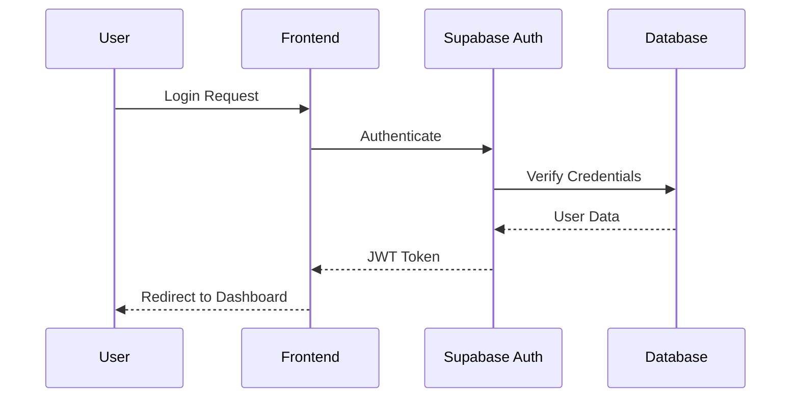
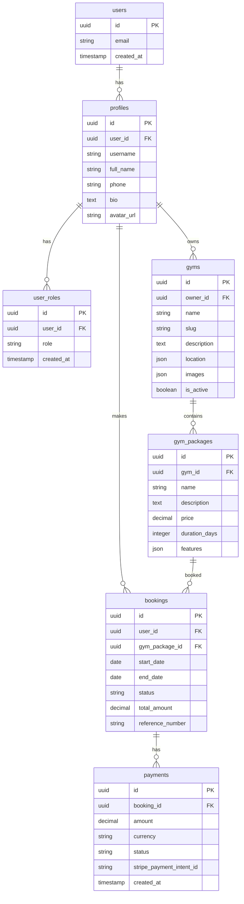
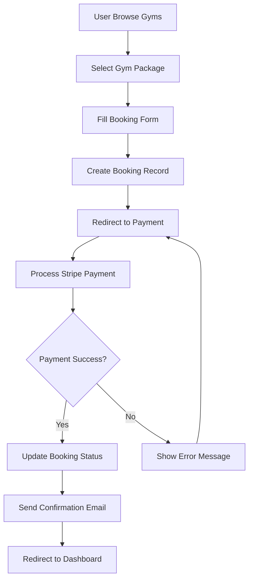
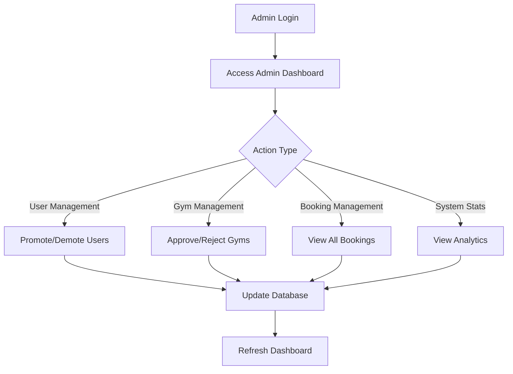

# สถาปัตยกรรมระบบ

เอกสารอธิบายสถาปัตยกรรมและการออกแบบของโปรเจกต์ Muay Thai Next.js + Supabase

## 📋 ภาพรวมสถาปัตยกรรม

โปรเจกต์นี้ใช้สถาปัตยกรรม **Full-Stack Modern Web Application** ที่ประกอบด้วย:

```
┌─────────────────┐    ┌─────────────────┐    ┌─────────────────┐
│   Frontend      │    │   Backend       │    │   Database      │
│   (Next.js)     │◄──►│   (Supabase)    │◄──►│   (PostgreSQL)  │
└─────────────────┘    └─────────────────┘    └─────────────────┘
         │                       │                       │
         ▼                       ▼                       ▼
┌─────────────────┐    ┌─────────────────┐    ┌─────────────────┐
│   UI/UX         │    │   API Gateway   │    │   Storage       │
│   (Tailwind)    │    │   Auth          │    │   (Supabase)    │
└─────────────────┘    └─────────────────┘    └─────────────────┘
```

## 🏗️ Technology Stack

### Frontend
- **Framework**: Next.js 15 (App Router)
- **Language**: TypeScript
- **Styling**: Tailwind CSS
- **State Management**: React Context + Hooks
- **Forms**: React Hook Form + Zod validation

### Backend
- **BaaS**: Supabase
- **Database**: PostgreSQL
- **Authentication**: Supabase Auth
- **Storage**: Supabase Storage
- **Real-time**: Supabase Realtime

### External Services
- **Payment**: Stripe
- **Email**: Resend
- **Deployment**: Vercel

### Development Tools
- **Testing**: Playwright (E2E)
- **Linting**: ESLint + Prettier
- **Type Checking**: TypeScript
- **Database**: Supabase CLI

## 🗂️ Project Structure

```
muaythai-next-postgres/
├── src/
│   ├── app/                     # Next.js App Router
│   │   ├── (auth)/             # Authentication routes
│   │   ├── (dashboard)/        # Dashboard routes
│   │   ├── api/                # API routes
│   │   ├── globals.css         # Global styles
│   │   ├── layout.tsx          # Root layout
│   │   └── page.tsx            # Home page
│   ├── components/             # Reusable components
│   │   ├── ui/                 # Base UI components
│   │   ├── forms/              # Form components
│   │   ├── layout/             # Layout components
│   │   └── features/           # Feature-specific components
│   ├── contexts/               # React contexts
│   │   ├── AuthContext.tsx     # Authentication context
│   │   └── ThemeContext.tsx    # Theme context
│   ├── lib/                    # Utilities and configurations
│   │   ├── supabase/           # Supabase client and types
│   │   ├── stripe/             # Stripe configuration
│   │   ├── validations/        # Zod schemas
│   │   └── utils.ts            # Utility functions
│   ├── services/               # API services
│   │   ├── auth.ts             # Authentication services
│   │   ├── gyms.ts             # Gym-related services
│   │   ├── bookings.ts         # Booking services
│   │   └── payments.ts         # Payment services
│   ├── types/                  # TypeScript type definitions
│   │   ├── database.ts         # Database types
│   │   ├── auth.ts             # Auth types
│   │   └── api.ts              # API types
│   └── middleware.ts           # Next.js middleware
├── docs/                       # Documentation
├── scripts/                    # Database scripts
├── supabase/                   # Supabase configuration
├── tests/                      # Test files
└── public/                     # Static assets
```

## 🔐 Authentication & Authorization

### Authentication Flow



### Role-Based Access Control (RBAC)

| Role | Permissions | Access Level |
|------|-------------|--------------|
| **User** | - View gyms<br>- Make bookings<br>- Manage own profile | Read: Public data<br>Write: Own data |
| **Partner** | - All User permissions<br>- Manage own gyms<br>- View own bookings<br>- Update gym info | Read: Own gym data<br>Write: Own gym data |
| **Admin** | - All permissions<br>- Manage all users<br>- Manage all gyms<br>- System administration | Read: All data<br>Write: All data |

### Row Level Security (RLS)

```sql
-- Example RLS Policy
CREATE POLICY "Users can view public gym data" ON gyms
    FOR SELECT USING (true);

CREATE POLICY "Partners can manage their own gyms" ON gyms
    FOR ALL USING (auth.uid() = owner_id);

CREATE POLICY "Admins can manage all gyms" ON gyms
    FOR ALL USING (
        EXISTS (
            SELECT 1 FROM user_roles 
            WHERE user_id = auth.uid() 
            AND role = 'admin'
        )
    );
```

## 🗄️ Database Design

### Core Tables



### Database Functions

```sql
-- Helper Functions
CREATE OR REPLACE FUNCTION is_admin()
RETURNS boolean AS $$
BEGIN
    RETURN EXISTS (
        SELECT 1 FROM user_roles 
        WHERE user_id = auth.uid() 
        AND role = 'admin'
    );
END;
$$ LANGUAGE plpgsql SECURITY DEFINER;

CREATE OR REPLACE FUNCTION owns_gym(gym_id uuid)
RETURNS boolean AS $$
BEGIN
    RETURN EXISTS (
        SELECT 1 FROM gyms 
        WHERE id = gym_id 
        AND owner_id = auth.uid()
    );
END;
$$ LANGUAGE plpgsql SECURITY DEFINER;
```

## 🔄 Data Flow

### Booking Flow



### Admin Management Flow



## 🎨 Frontend Architecture

### Component Hierarchy

```
App Layout
├── Navigation
│   ├── Header
│   ├── UserMenu
│   └── MobileMenu
├── Main Content
│   ├── Page Layout
│   ├── Feature Components
│   └── UI Components
└── Footer
```

### State Management

```typescript
// Context Pattern
interface AuthContextType {
  user: User | null;
  loading: boolean;
  signIn: (email: string, password: string) => Promise<void>;
  signOut: () => Promise<void>;
  updateProfile: (data: ProfileData) => Promise<void>;
}

// Custom Hooks
function useAuth() {
  const context = useContext(AuthContext);
  if (!context) {
    throw new Error('useAuth must be used within AuthProvider');
  }
  return context;
}
```

### API Layer

```typescript
// Service Pattern
class GymService {
  static async getGyms(filters?: GymFilters): Promise<Gym[]> {
    const { data, error } = await supabase
      .from('gyms')
      .select('*, gym_packages(*)')
      .eq('is_active', true);
    
    if (error) throw error;
    return data;
  }

  static async createGym(gymData: CreateGymData): Promise<Gym> {
    const { data, error } = await supabase
      .from('gyms')
      .insert(gymData)
      .select()
      .single();
    
    if (error) throw error;
    return data;
  }
}
```

## 🔒 Security Architecture

### Security Layers

1. **Frontend Security**
   - Input validation with Zod
   - XSS protection
   - CSRF protection
   - Secure headers

2. **API Security**
   - JWT authentication
   - Rate limiting
   - Input sanitization
   - CORS configuration

3. **Database Security**
   - Row Level Security (RLS)
   - Role-based permissions
   - Encrypted connections
   - Audit logging

### Security Best Practices

```typescript
// Input Validation
const createGymSchema = z.object({
  name: z.string().min(1).max(100),
  description: z.string().max(1000),
  location: z.object({
    address: z.string().min(1),
    lat: z.number(),
    lng: z.number(),
  }),
});

// Sanitization
function sanitizeInput(input: string): string {
  return input.trim().replace(/<script\b[^<]*(?:(?!<\/script>)<[^<]*)*<\/script>/gi, '');
}

// Authorization Check
async function requireAdmin(req: NextRequest) {
  const user = await getUser(req);
  if (!user || !await isAdmin(user.id)) {
    throw new Error('Unauthorized');
  }
}
```

## 📊 Performance Architecture

### Optimization Strategies

1. **Frontend Optimization**
   - Next.js App Router for optimal loading
   - Image optimization with next/image
   - Code splitting and lazy loading
   - Caching strategies

2. **Database Optimization**
   - Proper indexing
   - Query optimization
   - Connection pooling
   - Read replicas (future)

3. **API Optimization**
   - Response caching
   - Pagination
   - Data prefetching
   - Compression

### Monitoring & Analytics

```typescript
// Performance Monitoring
export function trackPageView(page: string) {
  if (typeof window !== 'undefined') {
    // Analytics tracking
    gtag('config', GA_TRACKING_ID, {
      page_title: page,
      page_location: window.location.href,
    });
  }
}

// Error Tracking
export function trackError(error: Error, context?: string) {
  console.error('Application Error:', error, context);
  // Send to error tracking service
}
```

## 🚀 Deployment Architecture

### Environment Strategy

```
Development → Staging → Production
     ↓           ↓         ↓
Local Supabase → Staging DB → Production DB
     ↓           ↓         ↓
Local Server → Vercel Preview → Vercel Production
```

### CI/CD Pipeline

```yaml
# Simplified CI/CD Flow
Build → Test → Deploy
  ↓      ↓      ↓
TypeScript → E2E Tests → Vercel
ESLint → Unit Tests → Database Migration
Prettier → Integration Tests → Environment Config
```

## 🔄 Scalability Considerations

### Current Architecture Limits
- Single database instance
- Monolithic frontend
- Limited caching

### Future Scalability Plans
1. **Database Scaling**
   - Read replicas
   - Database sharding
   - Caching layer (Redis)

2. **Frontend Scaling**
   - Micro-frontends
   - CDN optimization
   - Edge computing

3. **API Scaling**
   - Microservices architecture
   - API Gateway
   - Load balancing

## 📚 Documentation Standards

### Code Documentation
- TypeScript interfaces for all data structures
- JSDoc comments for complex functions
- README files for each major directory
- Architecture Decision Records (ADRs)

### API Documentation
- OpenAPI/Swagger specifications
- Example requests and responses
- Error code documentation
- Rate limiting information

## 🤝 Development Workflow

### Git Workflow
```
main (production)
├── develop (staging)
│   ├── feature/user-authentication
│   ├── feature/gym-management
│   └── hotfix/payment-bug
└── release/v1.2.0
```

### Code Review Process
1. Feature branch creation
2. Development and testing
3. Pull request creation
4. Code review and approval
5. Merge to develop
6. Staging deployment and testing
7. Merge to main
8. Production deployment

## 📞 Support & Maintenance

### Monitoring
- Application performance monitoring
- Database performance monitoring
- Error tracking and alerting
- User analytics

### Maintenance Tasks
- Regular database backups
- Security updates
- Performance optimization
- Feature updates and bug fixes

---

สถาปัตยกรรมนี้ออกแบบมาเพื่อความยืดหยุ่น ความปลอดภัย และความสามารถในการขยายตัว โดยใช้เทคโนโลยีสมัยใหม่และแนวทางปฏิบัติที่ดีที่สุด